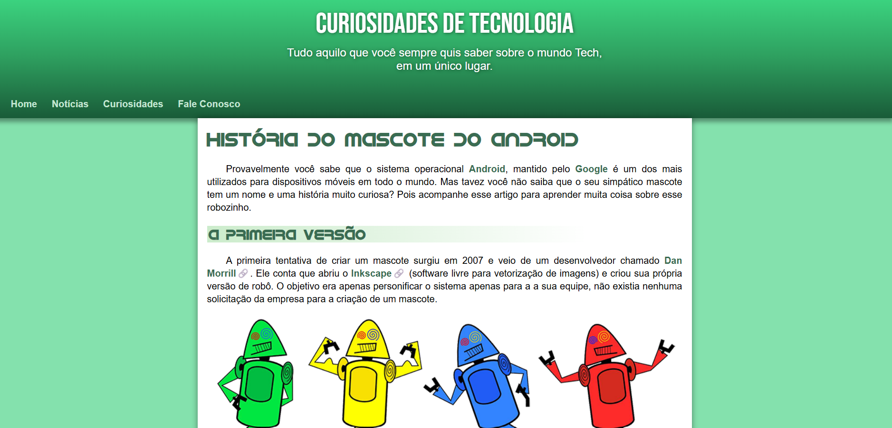

# Projeto Android

## Sobre o Projeto

O **Projeto Android** é um site responsivo desenvolvido com **HTML5** e **CSS3**, inspirado na história do surgimento do mascote do Android. O projeto simula um artigo completo, explorando diversos conceitos fundamentais de desenvolvimento web, com foco em semântica, responsividade e boas práticas de estilização.

O principal objetivo foi colocar em prática os conhecimentos adquiridos durante os estudos de HTML e CSS, criando uma página moderna, organizada e agradável para diferentes tamanhos de tela.

---

## Tecnologias Utilizadas

- HTML5
- CSS3
- Visual Studio Code

---

## Recursos Aplicados

Durante o desenvolvimento deste projeto foram utilizados diversos recursos, entre eles:

- Estrutura semântica com HTML5
- Layout totalmente responsivo
- Uso de variáveis CSS (`:root`)
- Fontes personalizadas com `@font-face`
- Fonte externa utilizando Google Fonts
- Paleta de cores personalizada
- Header e navegação estilizados
- Efeitos `hover` nos links
- Pseudo-classes
- Pseudo-elementos
- Organização do conteúdo utilizando `<main>`, `<article>`, `<aside>` e `<footer>`
- Imagens responsivas
- Vídeo incorporado do YouTube
- Listas personalizadas com ícones
- Bordas arredondadas e sombras
- Centralização e alinhamento de conteúdo
- Boas práticas de organização do CSS

---

## Objetivos do Projeto

- Praticar HTML5 semântico;
- Desenvolver páginas responsivas;
- Aprimorar conhecimentos em CSS3;
- Trabalhar com tipografia, cores e organização visual;
- Criar um layout limpo e agradável para leitura.

---

## Aprendizados

Este projeto foi importante para reforçar conceitos como:

* Estruturação semântica de páginas web;
* Responsividade utilizando CSS;
* Organização e reutilização de estilos;
* Utilização de variáveis CSS;
* Importação de fontes externas e locais;
* Incorporação de vídeos;
* Criação de componentes visuais reutilizáveis;
* Desenvolvimento de layouts mais profissionais.

---

## Demonstração

**Acesse o projeto:**

> **Link:** <a href="https://pedroaraujo07.github.io/projeto-redes-sociais/" target="_blank">Link do site</a>

 

**Preview do projeto:**

---

## Autor

Desenvolvido por **Pedro Araujo** como parte dos estudos de HTML e CSS.
